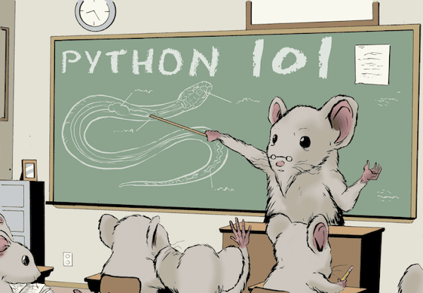
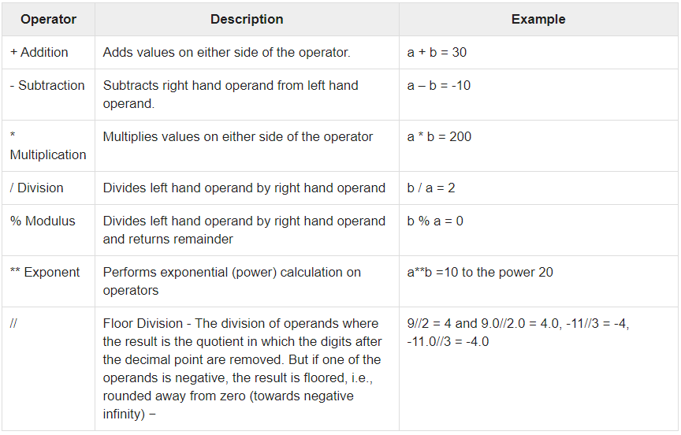
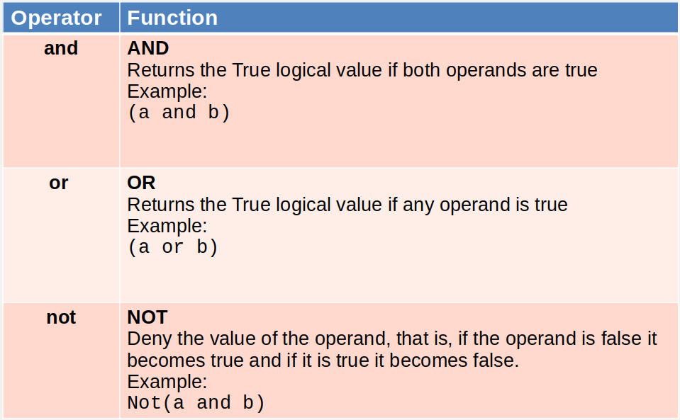
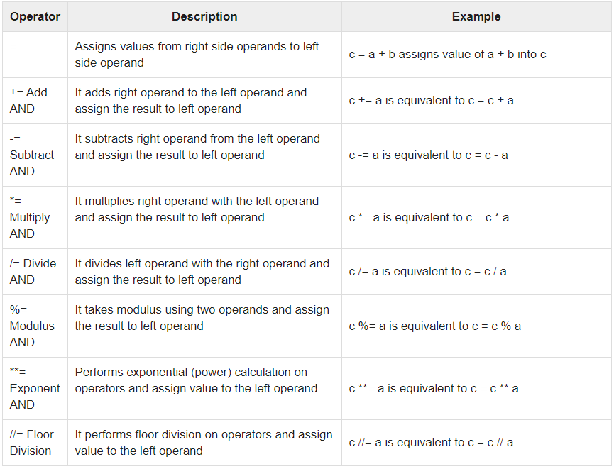

# Resources

[Introduction to Python](https://docs.python.org/3/reference/introduction.html)
[Python TOC](https://docs.python.org/3/contents.html)

# Python I

- What is Python?
- Python Applications
- Install the environment



# What is Python?

- Python is an **object-oriented**, **high-level**, **dynamically typed** and **interpreted** language
- **Platform** independent
- Easy to pickup and code
- Great as **scripting language**
- Plugable
- Full of **modules** that allows automation
- **bash** friendly

#### Example of modules
- boto (AWS)
- google-cloud-storage (GCP)
- gitapi
- ansible *(is written in python)*
- django *(framework for Web dev)*
- flask *(another framework for Web dev)*
- selenium *(extensible with python)*


# The language 

Python is an object-oriented programming language created in 1989. It is designed for rapid prototyping of complex applications.

It can be run in **Linux**, **MacOS**, **Windows** and more and is extensible to C or C++. 

Many large companies use the Python nowadays.

Python is widely used in Artificial Intelligence, Natural Language Generation, Neural Networks and other advanced fields of Computer Science. Python had deep focus on code readability & this class will teach you python from basics

- It is **free** and **simple** to learn. 
- Its primary features are that it is **high-level**, **dynamically typed** and **interpreted**. 

This makes debugging of errors easy and encourages the rapid development of application prototypes, marking itself as the language to code with.

It supports functional and structured programming methods as well as OOP.

It can be used as a scripting language or can be compiled to byte-code for building large applications.

It provides very high-level dynamic data types and supports dynamic type checking.

It supports automatic garbage collection.

It can be easily integrated with C, C++, COM, ActiveX, CORBA, and Java.

# Applications

- Web Development: Some of the most well-known frameworks are Django, Flask, Pyramid
- Game Development: PySoy which is a 3D game engine supporting Python 3, PyGame which provides functionality and a library for game development
- Machine Learning and Artificial Intelligence: libraries such as Pandas, Scikit-Learn, NumPy and so many more
- Data Science and Data Visualization
- Desktop GUI
- Web Scraping
- Audio and Video Applications
- And more….

# Installing python

We’ll be using **PyCharm** that is a cross-platform editor developed by JetBrains. Pycharm provides all the tools you need for productive Python development.
First of all, you have to install Python on your laptop

Visit the official website of Python http://www.python.org/downloads/ and choose the latest version for your OS.

Run the file you downloaded and follow the steps to install it. 


Programs and other executable files can be in many directories, so operating systems provide a search path that lists the directories that the OS searches for executables.

- Setting path at **Linux or Mac** In the bash shell type: 
    - `export PATH="$PATH:/usr/local/bin/python"`

- Setting path at **Windows** At the command prompt type: 
    - Assuming your Python installation is located at *C:\Python*
    - `path %path%;C:\Python`

### PyCharm

- To download PyCharm visit this [website](https://www.jetbrains.com/pycharm/download/) and Click the "DOWNLOAD" link under the Community Section

**Run the Setup** wizard to install PyCharm on your laptop
Once installation finished, you should receive a message screen that PyCharm is installed.

Now you can find PyCharm on your laptop to run it.

Once you see the introductory screen, you can select “Create New Project” 

#### You will need to select a location.

You can select the location where you want the project to be created. If you don’t want to change location than keep it as it is but at least change the name from “untitled” to something more meaningful, like “FirstProject”.

PyCharm should have found the Python interpreter you installed earlier.
- Next Click the **Create** Button.

So to start, as I said, we are going to think about a program that is so simple, it does not make sense to write many lines of code.

Go up to the “File” menu and select “New”. Next, select “Python File”. Now type the name of the file you want (Here we give “hello-world”) and hit “OK”.

Write on the file (and click on Run after saving!):

- `print (“Hello World!”)`


# Your first python program

There is another way to run the program, from outside your IDE.
Let’s say that our script was saved as `hello-world.py`
From the bash or command line, we can type

- `python hello-world.py`

And the result will be

> Hello World!


## Inside the program

The line `print (”Hello World”) `

This is an instruction that tells the Python interpreter to display the text that is within parentheses.

We see that text strings are enclosed in double quotation marks "".

You can print multiple lines or use modifiers to the function print:
```python
print ("Welcome to class!")
print (8 * "\n")
print ("Welcome to class!")
```
# Python II
---

# Python components
- Comments
- Identifiers and Reserved Words
- Variables and constants
- Operators
- Literals
- Expressions
- Using the console and keyboard

It is necessary to begin to know the rules of the language in which we’ll describe the components of the program.

**There are rules:**
- [**Lexicons**](https://docs.python.org/3/reference/lexical_analysis.html) for writing correct words
- **Syntax** for writing valid sentences with these words
- **Semantics** which allow us to give an interpretation to the "sentences" that we write in this language.


> About **coding**:
- Writing a program equals **to coding**
- Source code can be located in **one** or **more** files
- Every programming language has their own **rules**

## Comments

The comments are ignored by the compiler, they only serve so that we can write annotations that are useful both for us and for people who read the source code.

```python
# Single Line comment    

""" 
Multiline comment 
Another commented line
"""
```

## Identifiers

An identifier is a symbolic name that we give to a program element (**variables**, **objects**, **instances**, etc), which we use to refer to it and use it throughout the program.

### The basic rules for declaring valid identifiers are: 
- The identifier name **must** begin with a letter or a "_" and then an arbitrary sequence of letters, numbers or a "_".
- Punctuation characters such as @, $, and % within identifiers are **not** allowed. 
- Python is a case sensitive programming language. Thus, **Manpower** and **manpower** are two different identifiers in Python.

### Naming conventions for Python identifiers:

- **Class names** start with an **uppercase letter**. All other identifiers start with a lowercase letter.
- Encapsulation:
    - Starting an identifier with a *single leading underscore* indicates that the identifier is **private**
    - Starting an identifier with *two leading underscores* indicates a **strongly private** identifier.
- If the identifier also **ends** with *two trailing underscores*, the identifier is a **language-defined** special name.

### Reserved words

Reserved word is all sequence of characters that is predefined in order to specify what we want to do within the program. 
- Specific Instructions
    - if, while, for, etc.
- Declarations
    - def, class, etc.
- Flow Management
    - continue, break, return, etc.
- Python **does not** allow us to redefine its meaning and can not create new reserved words.


## Lines & Indentation 

Python provides no braces to indicate blocks of code for class and function definitions or flow control. Blocks of code are denoted by line indentation, which is rigidly enforced.

The number of spaces in the indentation is variable, but all statements within the block must be indented the same amount.

```python
if True:
   print("True")
else:
   print("False")
```

Statements in Python typically end with a new line. Python does, however, allow the use of the line continuation character (\) to denote that the line should continue.

```python
total = item_one + \
        item_two + \
        item_three
```

Python accepts **single** ('), **double** (") and **triple** (''' or """) quotes to denote string literals, as long as the **same type** of quote starts and ends the string. The triple quotes are used to span the string across multiple lines.

```python
word = 'word'
sentence = "This is a sentence."
paragraph = """This is a paragraph. It is
made up of multiple lines and sentences."""
```
# Python III

## Variables and constants

It is a memory space reserved for storing data that will be used later.

Based on the data type of a variable, the **interpreter** allocates memory and decides what can be stored in the **reserved memory**. Therefore, by assigning different data types to variables, you can store integers, decimals or characters in these variables.

According to their mutability
- Variables
- Constants

3 properties:
- An identifier
- Store data (a value)
- Has a type (which we don’t declare, python **infers** it)

### Variables declaration

It is done in the following way:
- `VAR_NAME = EXPR`

Where:
- **VAR_NAME**: name that identifies the variable
- **EXPR**: Initial value

Examples:

```python
counter = 100        # An integer assignment
miles   = 1000.0     # A floating point
name    = "John"     # A string

print(counter)
print(miles)
print(name)
```

The data stored in memory can be of many types. Python has various standard data types that are used to define the operations possible on them and the storage method for each of them.

Python has five standard data types:
- Numbers (int, long, float, complex)
- String
- List
- Tuple
- Dictionary

Example:

```python
counter = 100        # An integer assignment
miles   = 1000.0     # A floating point
name    = "John"     # A string

print(type(counter))
print(type(miles))
print(type(name))
```
### Constants declaration

Similar to the declaration of a variable but with the name in **UPPERCASE**
It tells the compiler that the value can not be changed. 

Example: 

`PI = 3.14159`

## Operators

Operators are special symbols that perform specific operations with one, two or three operands, and then return a result. Operators are used to construct expressions.

### Examples:

- Arithmetic: **+**, **-**, **\***, **/**, **%**
- Logic: **and** or **&&**, **or**, **||**, **!**
- Relational: **<**, **<=**, **>**, **>=**, **==**, **!=**
- Assignment: **=**
- Bitwise: **|**, **^**, **~**
- Membership: **in**, **not in**
- Identity: **==**, **is**, **is not**

### Arithmetic Operators


### Logic Operators


### Relational Operators


### Assignment Operators


### Operators precedence
From **Higher Priority** to **Lower Priority**


## Literals

A literal is a succinct and easily visible way to write a value. Literals represent the possible choices in primitive types for that language. Some of the choices of types of literals are often integers, floating point, Booleans and character strings. Python support the following literals:

#### Supported literals
```
String literals   ::   "halo" , '12345'
Int literals   ::   0,1,2,-1,-2
Long literals   ::   89675L
Float literals   ::   3.14
Complex literals   ::   12j
Boolean literals   ::   True or False
Special literals   ::   None
Unicode literals   ::   u"hello"
List literals   ::   [], [5,6,7]
Tuple literals   ::   (), (9,),(8,9,0)
Dict literals   ::   {}, {'x':1}
Set literals   ::   {8,9,10}
```
**Examples:** *(Can you identify the types of each one?)*

```python 
result = True; 
cUpper= 'C'; 
b = 100; 
s = 10000; 
i = 100000;
```

## Expressions

Expressions are a combination Operands with Operators that is performed according to the language syntax, which evaluates and returns a single value.

- Operands are the elements to which operations are applied, they can be: variables, literals, constants, invocations to methods that return a value or even subexpressions
- Operators are the elements that carry a specific operation on the operands.

Expressions are part of a sentence.

Two categories:
- Simple Expressions: one operand
- Composed Expressions: several operands combined with operators

Operators combine operands of a certain type

### Simple Expressions
In **bold** we highlight the expressions

- res = **0** # assign 0 to res
- isBroken = **False** # assign false to isBroken.
- character = **'C'** # assign letter 'C' to character.
- res = **varA** # assign the value in varA to res

### Composed Expressions
In **bold** we highlight the expressions

- isBroken = **engineNotworking** or **gearboxNotWorking** # assign isBroken the result of the logic OR that combines other two operands.
- res = **5 + varA** # assign to res the result of the sum between literal 5 and varA.
- res = **(3 * 5) + varA**
- res = **5 + (6 * 5)  / 3 + (66 – 16) * 10**

# Python IV

### Console or (REPL - Read–Eval–Print Loop)

To enter python REPL open a terminal and type: `python3`, hit enter.

You should see something like this, pay attention to the **>>>** symbol, this is where we will enter commands and they will be parsed for now.

```
Python 3.8.2 (default, Apr 27 2020, 15:53:34) 
[GCC 9.3.0] on linux
Type "help", "copyright", "credits" or "license" for more information.
>>>
```

Displaying text in the console is relatively simpler and Python already has methods for this. 
> The fastest way is by doing this
- print("Text to show")


### Read and print
For Python 3, let’s see an example of how to read:
```python
n = input('Choose a number')
print ('Number %s \n' % (n))
```

Showing text in the console is very simple in Python, and to read from keyboard, is also pretty simple

For Python 2, reading from keyboard changes a little bit:
```python
raw_input('Choose a number')
```

**Note:** remember that this can raise an Exception if the input is not a number. We’ll see how to handle exceptions later

### Flow Controls

### Conditions (If statements)

As we studied in Conditional Logic, applications are written with conditions in mind, so let's see how that works.

The structure of a condition is the following:

```python
if CONDITION:
    # Condition is True
else:
    # Condition is False
```

Example:

```python
random_number = 101
if ( random_number == 100 ): 
    print("Value of the random number is equal to 100")
else:
    print("Value of the random number is NOT equal to 100")
```

We can start to mix and match things:

```python
random_number = input('Input a number: ')
if ( random_number == 100 ): 
    print("Value of the random number is equal to 100")
else:
    print("Value of the random number is NOT equal to 100")
```

We can also chain multiple conditions at once:

```python
random_number = int(input("Please enter an integer: "))
if random_number < 0:
    print('Negative')
elif random_number == 0:
    print('Zero')
elif random_number == 1:
    print('Single')
else:
     print('Higher value')

print("The value of random_number is: ", random_number)
```

## A bit more conceptual

In this section we will start to think like a developer and get a grasp of the types of solutions we can mix and match to solve a problem.

- Data Types
- Sentences/Statements
    - Declaration
    - Sequence
    - Decission-making (Selection)
    - Looping (Iteration)
- Block


### Never forget that 
- Data is a value about something.
- Variables are elements that store data.
- Every data, according to its nature, belongs to a type.
- A variable is always of some kind of type that determines the values it can assume.


## Python data types
> We have:
- Primitive data types
    - Number
    - Boolean or Logic
    - Characters
- Classes
    - Objects
        - From the data perspective, an object is a composite data type.

## Just to think
> What do primitives data types and classes have in common?

From a general perspective they are sets of "things”
- Primitive **Data Types**: Its “things” are simple indivisible values
- **Classes**: Its “things” are objects

## Data types
A variable can be 
- Primitive data type
- Class data type

These are **two** “big types”

> But whait, why do we care about this?

A Primitive data type variable
- Stores values that represent data.
- Value Variables. 

A Class data type variable
- Stores a value which is a reference to an object of the class.
- Reference Variables. 

### In summary
- Primitive data type variables store values of that type.
- Class type variables store references to objects of that class.

# Python Statements
Equals to natural language sentences
- Only they are for the Python compiler/interpreter
- Instead of ending with a dot, each sentence ends with the line

Represent each of the steps of the program.
- Each sentence is an executable code unit


### There are 3 main statement categories: 
- Expression or Sequence
- Decission-making (selection)
- Looping (Iteration)


Expression, decission-making and looping statements go inside a method or block
- Specifies the steps of algorithms.

## Sequence or Expression statements

They are a direct operation to be performed by your application
- They are called expressions because they express things.
- And also sequence because they are executed one after another in a sequential order.

4 types:
- Assignment 
- Invoke methods.
- Object Creation (Construction)
- Null (empty line)

### Assignment

We talked about them without calling them by that name.
Statements that use the assignment operator, linking to the left
an identifier and to the right an expression.

`<IDENTIFIER VAR> = <EXPR>`

Examples:
- num = 5
- num = num * 6
- emp1 = Employee("Zara", 2000)

Assignment statements are nor mathematical equalities.

### Method invocation
Used to invoke an object or class method.

`<IDENTIFIER VAR>.<IDENTIFIER METHOD>(<ARGUMENTS>)`
 
Examples:
- print(”Hello World!!!") 
- student.sayHi()

Arguments are not always used, it depends on the method

### Object Creation (Construction)

Instructions that consist of constructing objects returning a reference. 

`<CLASS TYPE> (<ARGUMENTS>)`

Examples:
- emp2 = Employee("Manni", 5000) 

## Decision-making and Looping or Control Flow Statements

Guide the execution flow 
- Control statements are the essence of any programming language, since they govern the flow of program execution.

These are used exclusively within the methods.

We used them when we have to make a decision to determine which sentences to execute
- Allowing us to branch to different places of the program according to what conditions are presented.


### Simple selection

Used to decide if a set of sentences is executed based on a condition. They respond to the idea of "If such thing then I do this" can additionally add a "but" to execute actions if the condition is not met.

**Example 1:**
```
if <condition>:
    <Statements executed if condition is TRUE>
else:
    <Statements executed if condition is FALSE>
```

### Iteration
Used to repeat a sentence or group of sentences (block) 
- The set of statements that are within the Cycle or Loop iteration. 

When we say “iterate through the cycles” we mean that we are executing the internal sentences.
- An iteration is equivalent to a cycle or loop execution.


#### For

The "For" sentence provides a compact way of traversing a set of values in a given order.

It is used a lot to perform iterations of which we know in advance how many cycles we are going to perform.

It is generally used to put all the code of a counter in a single instruction.

**For syntax:**

```python
for iterating_var in sequence
	<Statements> 
```

**Example:**
```python
for letter in 'ComIT':     # First Example
   print('Current Letter :', letter)

fruits = ['banana', 'apple',  'mango']
for fruit in fruits:        # Second Example
   print('Current fruit :', fruit)

for index in range(len(fruits)): # Third Example
   print('Current fruit :', fruits[index])
```

#### While
The while sentence is used to repeat a set of actions that must be performed while in such a condition.

The idea is that whatever sentences are in the cycle, they tend to make FALSE the iteration condition since otherwise it would never come out of this cycle and run forever.

**While syntax:**

```python
while <EXPRESSION>
<Statements>
```

**Example:**
```python
count = 0
while (count < 9):
   print('The count is:', count)
   count = count + 1

count = 0
while count < 5:
   print(count, " is  less than 5")
   count = count + 1
else:
   print(count, " is not less than 5")
```

**LOOP control**

the **break** statement terminates the current loop and resumes execution at the next statement.

```python
var = 10
while var > 0:              
   print('Current variable value :', var)
   var = var -1
   if var == 5:
      break
```


the **continue** statement returns the control to the beginning of the while or loop. The continue statement rejects all the remaining statements in the current iteration of the loop and moves the control back to the top of the loop

```python
for letter in 'ComIT':
   if letter == 'm':
      continue
   print('Current Letter :', letter)
```

The **pass** statement is a null operation; nothing happens when it executes. The pass is also useful in places where your code will eventually go, but has not been written yet

```python
for letter in 'ComIT': 
   if letter == 'm':
      pass
      print('This is pass block')
   print('Current Letter :', letter)
```

**For and While are friends**

The while cycle and the for cycle can be exchanged with ease, we can see it with the following example:i = 0

```python
while i < 10:
	# actions
	i=i+1

for i in range(10):
	# actions
```

**Cycle comparison**
|      | While | For |
|----------------------|-------|------|
| Use                  | When we do NOT know  the number of  iterations | When we do know  the number of  iterations
| Number of executions | 0 or more| 0 or more
| Used for             | When the termination condition is not numerical, for example: a boolean function, it is also useful for reading files | Count numbers, go through data structures
| Frequency of usage   | Frequently | Very frequently


**Block**

A compound sentence or block is a set of sentences indented to the right.

Syntactically, a block is considered as a single sentence.
- An executable code unit

From now on a sentence can be considered as both a block and a single sentence.

We tabulate to the right on each new block.
- Class definition
- Method definition
- Control flow structure
    - if, else, while and for define a scope.

> Each block defines a scope

## Functions

## Classes